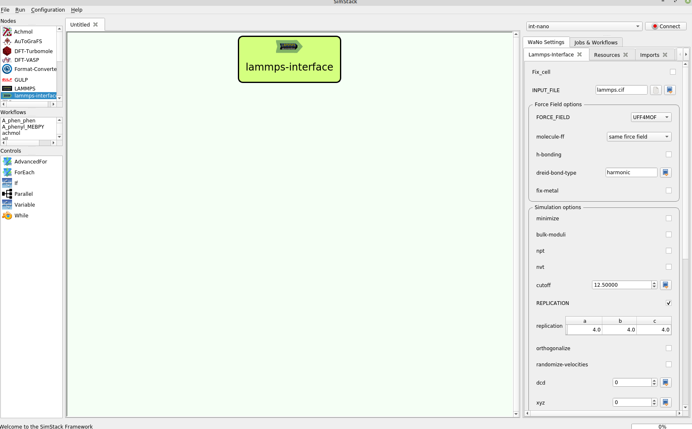

# lammps-interface

In this WaNo, user specifies parameters of molecular dynamics (MD) runs to be performed by *LAMMPS* WaNo. The options available are the same parameters in the lammps-interface software. The fix_cell is added to recenter the trajectory based on metals. *lammps-interface* WaNo is based on installing the software on anaconda and is loaded by anaconda3 module. 

|Option | Description |
|------------|-------------|
| outputcif | Write a .cif file for visualization. Necessary for debugging purposes, this file can show the user how the structure has been interpreted by the program.|
| outputpdb | Write a .pdb file for visualization. Necessary for debugging purposes, this file can show the user how the structure has been interpreted by the program. NB: currently deletes bonds that cross a periodic boundary so, for visualization purposes ONLY!!!!!|
| outputraspa | Write a .cif file for RASPA (FF types in _atom_site_label) Write pseudo_atoms.def file for this MOF Write force_field_mixing_rules.def file for this MOF Write force_field.def file for this MOF|
**Force Field options:**||
| force_field | Enter the requested force field to describe the system. Current options are 'BTW_FF', 'Dreiding', 'UFF', 'UFF4MOF', and 'Dubbeldam'. The default is set to the Universal Force Field [UFF].|
| molecule-ff | Chose a force field for any molecules found in the structure. This is applies a 'blanket' to all found molecules, so exercise with caution. Future iterations will consider an input file to differentiate force fields between different molecules. Default is the same force field requested for the framework (assumes some generalized FF like UFF or Dreiding).|
| h-bonding | Add hydrogen bonding potentials to the force field characterization. Currently only applies to Dreiding. Default is off.|
| dreid-bond-type | Request the Morse bond potential for the Dreiding force field. Default is harmonic.|
| fix-metal | Fix the metal geometries with modified potentials to match their input geometries. The potential isn't set to be overly rigid so that the material will behave physically in finite temperature calculations, however it may introduce some unintended artifacts so exercise with caution. Useful for structure minimizations. Currently only applies to UFF and Dreiding Force Fields. Default is off.|
|**Simulation options:**||
| minimize | Request input files necessary for a geometry optimization. Default off|
| bulk-moduli | Request input files necessary for an energy vs volume calculation. This will use values from ITER_COUNT and MAX_DEV to create the volume range|
| thermal-scaling | Request input files necessary for a temperature scaling calculation. This will use values from ITER_COUNT and MAX_DEV to create the temperature range|
| npt | Request input files necessary for an isothermal-isobaric simulation. This will use values from TEMP and PRESSURE, NEQSTP, and NPRODSTP to produce the input file.|
| nvt | Request input files necessary for an canonical simulation. This will use values from TEMP, NEQSTP, and NPRODSTP to produce the input file. Equilibration with a Langevin thermostat, Production with Nose-Hoover.|
| cutoff | Set the long-range cutoff to this value in Angstroms. This will determine the size of the supercell computed for the simulation. Default is 12.5 angstroms.|
| replication | Manually specify the replications to form the supercell Use comma, space or 'x' delimited values for the a,b,c directions. This is useful when dealing with flexible materials where you know that structural collapse will result in the box decreasing past 2*rcut|
| orthogonalize | Makes a supercell of the simulation box with more-or-less orthogonal supercell vectors. This is an approximation, but is useful for certain calculations. Default is FALSE.|
| randomize-velocities | Adds a velocity randomization of the atoms prior to finite temperature simulation. The velocities are randomized to TEMP.|
| dcd | Store trajectory of simulation in a dcd format every DUMP_DCD steps. Default is no trajectory file will be written.|
| xyz | Store trajectory of simulation in a xyz format every DUMP_XYZ steps. If not requested, then no trajectory file will be written.|
| lammpstrj | Store trajectory of simulation in a lammpstrj format every DUMP_LAMMPSTRJ steps. If not requested, then no trajectory file will be written.|
| restart | Store last snapshot of trajectory of simulation in lammps traj file format. index of last step RESTART = NEQSTP + NPRODSTP. If NEQSTP and NPRODSTP are not specified, then RESTART=1|
|**Parameter options:** | |
| tolerance | Tolerance in angstroms to determine detection of inorganic clusters. Default is 0.4 angstroms.|
| neighbour-size | To find SBUs in the framework via pattern recognition. This parameter determines how large a subset of atoms to search around each central atom in the framework. Central atoms are typically considered the metal species for inorganic SBUs or carbon/nitrogen for organic SBUs. This parameter will collect all atoms within NEIGHBOUR_SIZE bonds from the central atom. Default is 5. |
|iter-count | Number of iteration steps to change a variable of interest (temperature, volume). Default is 10 steps.|
| max-deviation | Max deviation of adjusted variable at each step is scaled by MAX_DEV/ITER_COUNT. Default is 0.01 (ideal for volume).|
| temperature | TEMP Simulation temperature. This parameter is used only if NPT or NVT are True. Default is 298.0 Kelvin.|
| pressure |  Simulation pressure. This parameter is used only if NPT is True. Default is 1.0 atmosphere.|
| production-steps | Number of production steps in the simulation. Applies to NPT and THERMAL_SCALING simulations. Default is 200,000 steps. (corresponding to 200 ps if the timestep is 1 fs)|
| equilibration-steps | Number of equilibration steps in the simulation. Applies to NPT and THERMAL_SCALING simulations. Default is 200,000 steps. (corresponding to 200 ps if the timestep is 1 fs)|
